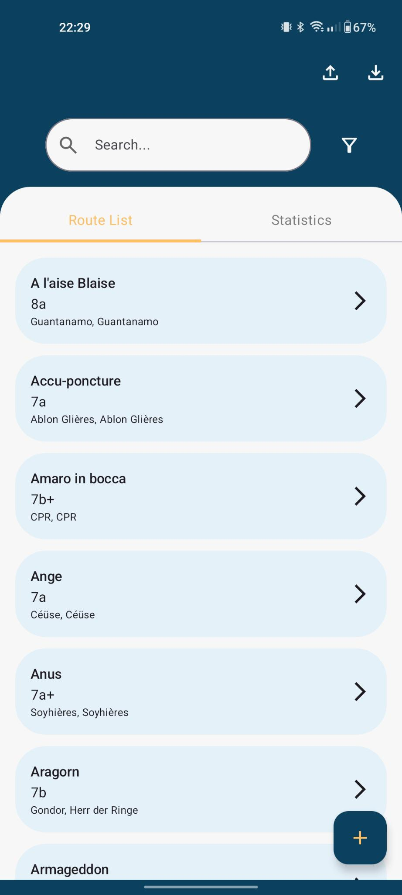
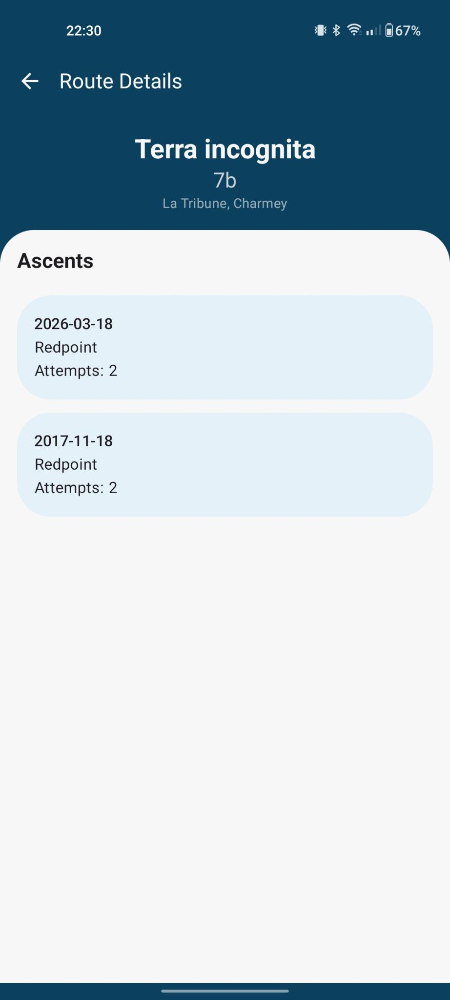

### Overview
This repository is part of the AscentLister Project and contains the mobile app. The goal for this project was to create an mobile app where I and you can log the climbing route ascents. The project is designed and set up as a local system, where everyone runs a database, api and app on its own. Therefor, there is no user integration, clientid and secret are used for connection and authentication. 

 

The project contains the following repos:

- https://github.com/OliverFrey/AscentLister
- https://github.com/OliverFrey/AscentListerAPI

### How to use it
1. Set up the AscentListerAPI. For instructions see the readme in the repository
2. Pull the source code and add the following values to the "local-properties"-file:
   
   properties
   
   KEYCLOAK_AUTH_URL="your-auth-url"

   KEYCLOAK_CLIENT_ID="your-api-client-id"
   
   KEYCLOAK_CLIENT_SECRET="your-api-client-secret"
   
   BASE_URL="your-ipa-url"
4. Run the app on your local device

### Included and planned functions
##### Included
- Function to add Ascents, Routes and Locations 
- Function to download Ascents, Routes and Locations from the API
- Function to upload Ascents, Routes and Locations to the API
- Search option for Route names
- Detail view for Routes with Ascents listed

##### Planned
- Statistics tab with statistics ordered by year, ascent types and grades
- More advanced search option with different Filters, option to search for locations and filter by grades

